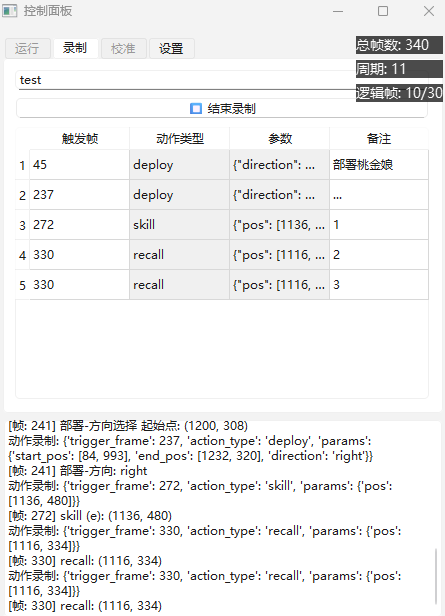

# Arknights 自动作战工具

这是一个为游戏《明日方舟》设计的自动化作战工具，支持MuMu模拟器。
通过将 **感知 (Perception)**、**分析 (Analysis)** 和 **控制 (Control)** 分离到独立的进程中，通过高效的进程间通信（IPC）机制进行协作，实现低延迟、帧级精确的自动化操作。



## ✨ 核心特性

- **多进程架构**: 将截图、分析和控制逻辑解耦到独立的进程中，充分利用多核 CPU 性能，避免单点阻塞。
- **高性能 IPC**: 采用基于共享内存的 **三缓冲 (Triple Buffer)** 和 **双缓冲 (Double Buffer)** 机制，实现进程间的零拷贝、无锁数据交换，确保图像和状态数据的实时性。
- **帧级精确执行**: 通过实时分析游戏内的“费用条”，将视频流转换为精确的逻辑帧流。所有作战计划都基于此逻辑帧触发，实现可复现的精确操作。
- **图形用户界面 (GUI)**: 提供一个基于 PySide6 的完整控制面板，集成了运行、录制、校准和设置管理功能，易于上手。
- **可视化录制系统**: 用户只需像正常一样玩游戏，系统即可自动录制鼠标和键盘操作，并将其转换为结构化的作战计划（YAML格式）。
- **灵活的控制后端**: 控制器采用抽象基类设计，目前已实现基于 `pydirectinput` 的宏模拟 (`MumuMacroController`)，并可扩展至其他控制方式（如 `MaaTouch`）。

## 🏗️ 架构概览

本框架由四个核心进程和两个IPC缓冲区组成，协同工作以完成自动化任务。

| 进程 (组件) | 核心职责 | 输入源 | 输出 / 目标 |
| :--- | :--- | :--- | :--- |
| **Capture Process** | 以最高速度、最低延迟从模拟器抓取屏幕截图。 | <li>原始视频流 (来自模拟器) | <li>原始图像帧<br/>➡️ 写入 `TripleSharedBuffer` |
| **Ruler Process** | 分析图像帧，通过追踪费用条来确定游戏的**逻辑时间**（总帧数），并将此时间戳广播出去。 | <li>图像帧<br/>⬅️ 读取自 `TripleSharedBuffer` | <li>结构化的帧数据 (总帧数, 逻辑帧等)<br/>➡️ 写入 `DoubleSharedBuffer` |
| **Commander Process** | 根据预设的作战计划，在精确的逻辑帧数到达时执行相应操作。 | <li>逻辑帧数据<br/>⬅️ 读取自 `DoubleSharedBuffer`</li><li>作战计划 (`.yaml` 文件)</li> | <li>控制指令 (部署, 技能等)<br/>➡️ 发送至**控制引擎** |
| **Recorder Process** | 记录用户的键鼠操作，并将其与当前的逻辑帧数关联，以生成新的作战计划。 | <li>逻辑帧数据<br/>⬅️ 读取自 `DoubleSharedBuffer`</li><li>用户输入事件 (`pynput`)</li> | <li>新的作战计划<br/>➡️ 保存为 `.yaml` 文件 |


## 🚀 快速开始

### 1. 环境要求

- **Python包管理器**: `uv`

### 2. 安装

1.  克隆本仓库：
    ```bash
    git clone https://github.com/your-username/your-repo-name.git
    cd your-repo-name
    ```

2.  安装依赖项：
    ```bash
    uv sync
    ```

## 🎮 使用教程

### 1. 通过图形界面进行操作

```bash
uv run -m ui.main_ui
```

### 2. 配置介绍
可以在GUI页面 **设置** 选项卡中进行配置，配置文件会保存到`configs/` 目录下
有两个主要的配置文件：
-   `mumu.yaml`:
    -   `mumu_base_path`: MuMu 模拟器12 的安装路径。
    -   `mumu_dll_path`: `MuMu12-Win64-2.1.20.dll` 文件的完整路径 (通常在 `\vms\nemu-vmonitor\bin\` 下)。
    -   `device_serial`: 模拟器的 ADB 地址，通常为 `127.0.0.1:16384`。
-   `settings.yaml`:
    -   `active_calibration_profile`: **极其重要**，指定 `Ruler` 进程要使用的校准文件名。初次使用时此项为空。
    -   `fps`: 测试时使用
    -   `perf_test_duration`：测试时长

---

### 3. 首次使用工作流程以及注意事项

1. 修改配置
2. 校准ruler
    - 进入战斗
    - 进入子弹时间，保持时间流逝
    - 点击 **校准** 选项卡中的 **开始校准**
    - 等待结束
3. 录制操作
    1.  切换到 GUI 的 **录制 (Record)** 标签页。
    2.  在输入框中为你的新计划命名（例如 `my_first_plan`）。
    3.  点击 **"开始录制"** 按钮。
    4.  切换到模拟器窗口，正常进行游戏操作。系统会记录下你的部署、技能、撤退等操作，并实时显示在表格中。
        -   **部署**: 从干员栏**右键**拖拽到地图上，然后**左键**拖拽确定方向。
        -   **技能**: 鼠标侧键 X2，或按 `E` 键。
        -   **撤退**: 鼠标侧键 X1，或按 `Q` 键。
    5.  操作完成后，点击 **"结束录制"** 按钮，作战计划将自动保存到 `plans/` 目录下
    **注意事项**
    - 如需备注则需手动添加
    - 自动获取的触发帧可以手动修改
    - 操作录制基于up主: b站 BV1XwGpzYEHS
    - 手动操作时，尽可能靠近格子中心
4. 运行回放
    1.  切换到 GUI 的 **运行 (Run)** 标签页。
    2.  从下拉菜单中选择你刚刚录制的作战计划。
    3.  进入对应的关卡，在“开始行动”之后、第一个干员可部署之前，点击 **"开始运行"** 按钮。
    4.  程序将自动接管，并根据计划精确执行所有操作。
    **注意事项**
    * 出现操作偏移情况
        1. 录制时尽可能将准星放到格子中心
        2. 手动修改配置文件坐标
---

### 4. 问题
1. 时间准了，但是操作靠录制的真不一定准
---
## 🙏 致谢

受到以下优秀项目的启发，参考了很多，在此表示衷心的感谢：
- **[ArknightsCostBarRuler](https://github.com/ZeroAd-06/ArknightsCostBarRuler)**
- **[MaaAssistantArknights](https://github.com/MaaAssistantArknights/MaaAssistantArknights)** 
